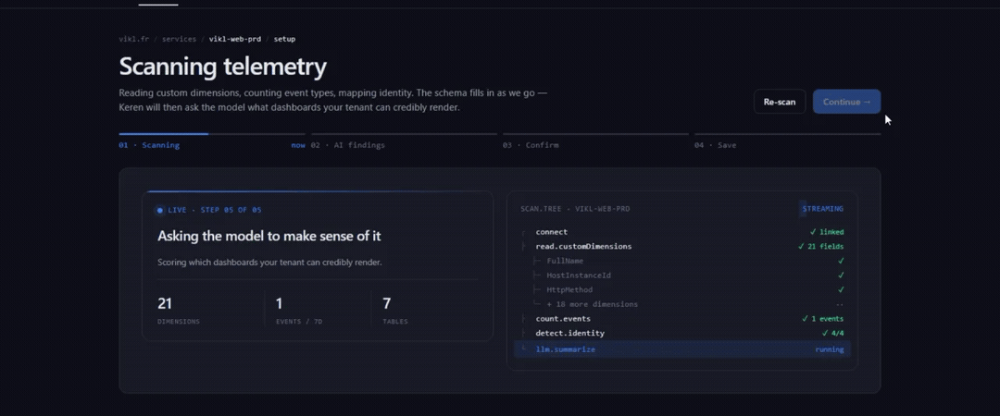

# Keren Analytics

[](https://github.com/lionelgarnier/keren-analytics/actions/workflows/tests.yml)
[](https://github.com/lionelgarnier/keren-analytics/actions/workflows/security-audit.yml)
[](LICENSE)
[](package.json)

> Turn Azure Application Insights into shareable **Marketing & Technical
> dashboards in under 2 minutes** — AI-mapped schema, deterministic KQL,
> raw telemetry rows never persisted. MIT.

<p align="center">
  
</p>

**Live demo** · [keren.run](https://keren.run) — sample
dataset, sign in with any Microsoft work/school account to point it at your
own Application Insights resource.

---

## Why it exists

The Azure portal can answer "how many requests came in last hour?", but
turning App Insights into a *Marketing* dashboard (campaigns, geo,
funnels) or a clean *Technical* view (top slow endpoints, error rate
trends) means hand-writing KQL and rebuilding the same charts every
project. Keren Analytics gives you both views, plus a readiness score
that tells you which signals are missing before you ask.

## Try it now

```bash
git clone https://github.com/lionelgarnier/keren-analytics.git
cd keren-analytics
docker compose up --build
```

Then open `http://localhost:3000`. The default mode is **mock** — a
deterministic sample dataset that lets you click around with no Azure
account at all.

For production-like local runs, set a real session secret first:

```bash
SESSION_SECRET=$(node -e "console.log(require('crypto').randomBytes(32).toString('hex'))") \
NODE_ENV=production docker compose up --build
```

For real Azure mode, see [Setup: Entra ID](docs/setup-entra-id.md). Three
commands and one `.env` file.

> **Heads-up — the setup above is for *the host* only, done once.**
> Your end users (colleagues, customers, public-demo visitors) do **not**
> register their own Azure app, do **not** create a client secret, and
> do **not** manage permissions. They click *"Connect your Azure"* on
> the landing page and sign in with their normal Microsoft account —
> same flow as Slack / Loom / Notion. The token Keren Analytics receives
> is *delegated*, so the app reads only what the user already had access
> to. Tenant admins may see a one-time consent screen the first time
> someone from their org signs in; that's a single click.

## What's inside

- **Three pre-built views** — Marketing (acquisition, geo, funnels,
  campaigns), Technical (latency percentiles, error rate, top slow
  endpoints), Readiness (telemetry coverage 0–100 + AI prompts).
- **AI-style "Environment analysis" panel** that narrates your data in
  plain English from the same numbers the dashboard shows — deterministic
  by default, with optional Azure Foundry-backed mapping in setup.
- **First-run banner** that surfaces the two highest-leverage telemetry
  improvements (e.g. *"Add user identity (+15)"*) and scrolls you to the
  matching prompt card on the Readiness tab.
- **Period-over-period KPI deltas** — the top 3 tiles show
  `+13.6% vs last week` style chips; configurable today / 7d / 30d
  windows.
- **Schema auto-mapping** — alias table + regex pattern matching covers
  ~80% of real-world custom dimension naming (`uid`, `visitor_id`,
  `accountId`, etc.) with zero config; optional Azure Foundry mapping
  can refine proposals in setup.
- **Versioned KQL templates** rendered server-side with strict
  parameter substitution. Tenant identifiers never reach a query
  string.
- **MIT-licensed, single container** — Node 22, Express 5, Helmet,
  in-memory query cache, SQLite setup state. No agent to deploy on your apps.

## How it compares

| | **Keren Analytics** | Azure Portal | Datadog | Power BI |
|---|---|---|---|---|
| Time to first dashboard          | **~2 min** (Docker) | 30+ min (write KQL) | 1–2h (agent + setup) | hours (data prep) |
| Marketing vs Technical separation| Built-in            | Manual workbook     | Add-on                | Manual report      |
| Readiness scoring + AI prompts   | **0–100, LLM-ready prompts** | No        | Limited                | No                 |
| Custom-dimension auto-mapping    | Alias + regex (LLM optional) | Manual    | Manual                | Manual             |
| Data residency                   | **Raw telemetry rows never persisted; self-host to keep all processing in-network** | Native | New endpoint   | New endpoint       |
| License / cost                   | **MIT, free**       | Included w/ Azure   | Per-host $$$          | Per-user $$        |
| Self-hostable                    | Yes (`docker compose up`) | N/A           | No (SaaS)             | Limited            |

These are launch-time positions; the gaps narrow as each tool evolves.
The columns we're least kind to (Datadog, Power BI) are also the most
mature and have features we don't.

## Privacy & security

The product promise is that **raw telemetry rows are never persisted** —
no log table, no event store. The service keeps only setup metadata and
aggregated dashboard outputs in SQLite. What that means in practice
depends on where you run it:

- **Self-hosted** — the whole thing runs inside your own infrastructure,
  so no telemetry ever leaves your network.
- **Hosted (`keren.run`)** — the server holds your *delegated* OAuth
  token and runs the KQL against your Application Insights on your
  behalf. Query results therefore transit and are aggregated **on the
  Keren server** before being returned; they are never stored. Most
  payloads are aggregated metrics (counts, percentiles, geo/browser
  distributions, top-N pages); a few setup/technical surfaces can
  include scrubbed, bounded event-level snippets (for example recent
  session timelines). If you'd rather no data touched a third-party
  server at all, self-host.

That promise is encoded as automated checks in
[`scripts/security-audit.mjs`](scripts/security-audit.mjs). Seven
controls run on every push & PR plus a Monday cron — sensitive-data
logging, session-cookie hardening, CSP `script-src` purity, CSP CDN
allowlist review, no-raw-telemetry-persistence, committed `.env*`
placeholders, `npm audit` high+. The Security audit badge above is the
green light.

A separate badge for `npm test` makes regressions visible the moment
they land. Production refuses to boot without a real `SESSION_SECRET`
(no silent fallback). Per-IP rate limiting (60 req/min on dynamic
routes, 20 req/min on `/auth/*`) protects the public demo URL.

Security policy and reporting path: [`SECURITY.md`](SECURITY.md).

## Roadmap

- **v0.1.x** — what's on `main` and the launch-readiness sprint
  ([docs/backlog/launch-readiness.md](docs/backlog/launch-readiness.md))
- **Phase 3** — multi-tenant SaaS, persistence, real Azure OpenAI
  hardening and broader AI surfaces. Gated on traction signals
  ([docs/launch-strategy.md](docs/launch-strategy.md) §3).
- **Phase 4** — multi-cloud (AWS CloudWatch, GCP Cloud Logging) via
  the provider interface in
  [docs/architecture-multicloud.md](docs/architecture-multicloud.md).

The full per-track backlog lives under
[docs/backlog/](docs/backlog/) — each track marks what's BLOCKER,
STRONG, OPTIONAL, and what's deliberately out of scope.

## Configuration

Set in `.env` (copy from `.env.example`):

| Variable                   | Default     | Notes                                                                 |
|----------------------------|-------------|-----------------------------------------------------------------------|
| `AZURE_MODE`               | `mock`      | `mock` for the sample dataset, `real` for OAuth + your Azure tenant.  |
| `SESSION_SECRET`           | _required_  | 32+ random bytes in production; app refuses to boot otherwise.        |
| `AI_PROVIDER`              | `none`      | `none` (deterministic mapping) or `azure-foundry` (LLM-assisted setup). |
| `AZURE_CLIENT_ID` / `_SECRET` / `_REDIRECT_URI` / `_TENANT_ID` | — | Entra ID app registration; see [docs/setup-entra-id.md](docs/setup-entra-id.md). |
| `AZURE_FOUNDRY_ENDPOINT` / `_DEPLOYMENT` | — | Required only when `AI_PROVIDER=azure-foundry`. |
| `MOCK_RESOURCES=multiple`  | _unset_     | Mock mode toggle to simulate multiple App Insights resources.         |

Selected API surface (full list in [`src/server.js`](src/server.js)):

- `GET /dashboard/overview?range=7d` — dashboard payload (KPIs, charts,
  narration, period-over-period comparison) plus readiness + score.
- `GET /readiness` — telemetry coverage report.
- `GET /prompts` — LLM-ready prompts for missing signals.
- `GET /preview/dashboard?range=7d` — no-auth sample dashboard.

## Contributing

**MIT — here's the architecture, PRs and good-first-issues welcome.**

The repo runs in mock mode with no Azure account, so you can be poking at
real data flows within a couple of minutes:

```bash
git clone https://github.com/lionelgarnier/keren-analytics.git
cd keren-analytics && npm install && npm run dev   # http://localhost:3000
```

- **New here?** [`ARCHITECTURE.md`](ARCHITECTURE.md) maps the code for a
  human — the request flow, where mock mode / readiness score / LLM
  prompts live.
- **Looking for a first task?**
  [`docs/good-first-issues.md`](docs/good-first-issues.md) lists starter
  tasks anchored in real files, from 30-minute cosmetics to small
  features. They're also filed as
  [`good first issue`](https://github.com/lionelgarnier/keren-analytics/issues?q=is%3Aissue+is%3Aopen+label%3A%22good+first+issue%22)
  on the tracker.
- **Opening a PR?** [`CONTRIBUTING.md`](CONTRIBUTING.md) has the dev loop
  and what we expect; [`CLAUDE.md`](CLAUDE.md) documents the invariants
  PRs must respect (mock parity, no raw log persistence, KQL
  substitution-only, range whitelist, OAuth secret handling).

Code of conduct: [Contributor Covenant 2.1](CODE_OF_CONDUCT.md).

### Contributors

Thanks to everyone who has sent a PR — this project is better for it. 🙏

[](https://github.com/lionelgarnier/keren-analytics/graphs/contributors)

## License

[MIT](LICENSE) — see the LICENSE file. © Lionel Garnier and contributors.

---

If this saves you a Tuesday afternoon of writing KQL by hand, please
**⭐ star the repo** — it's how the project finds its next 100 users.
